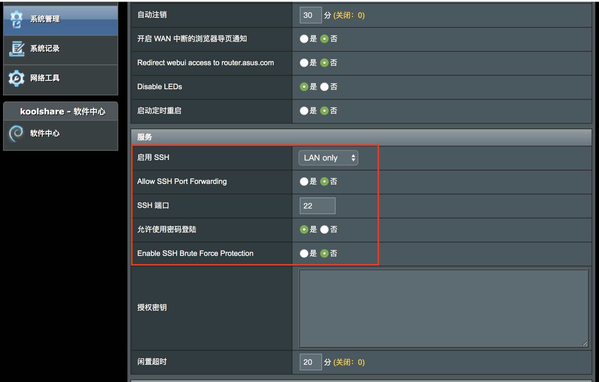
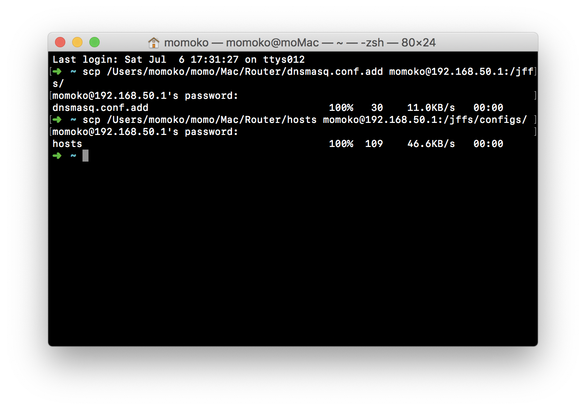
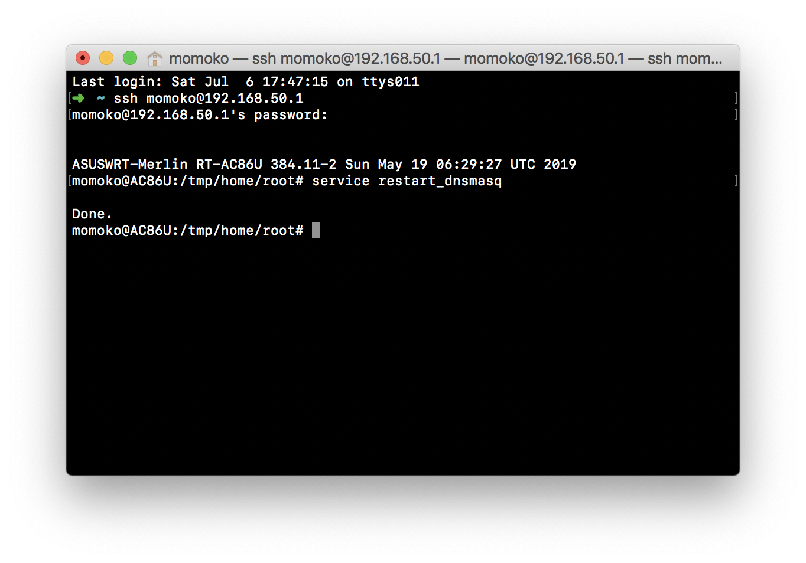
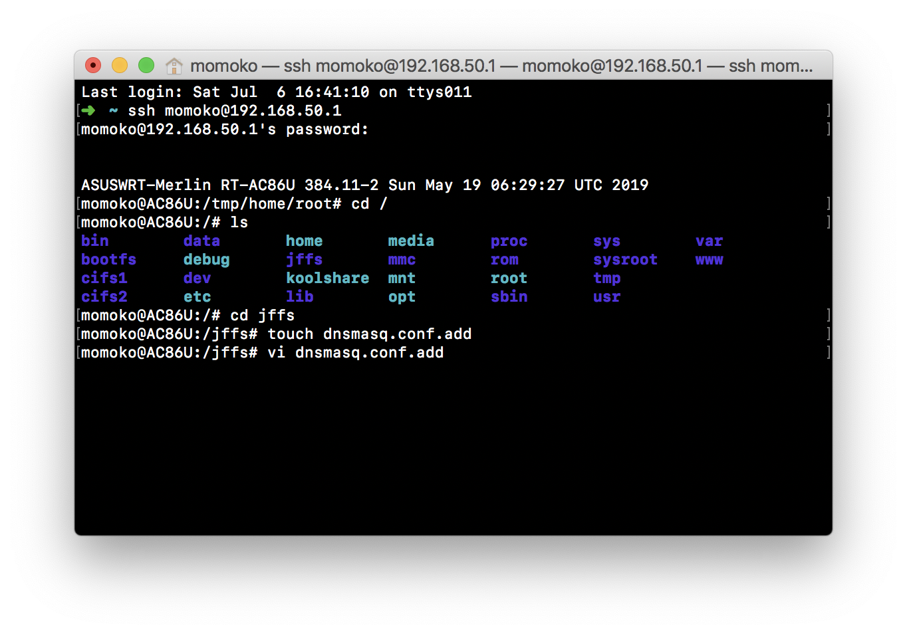
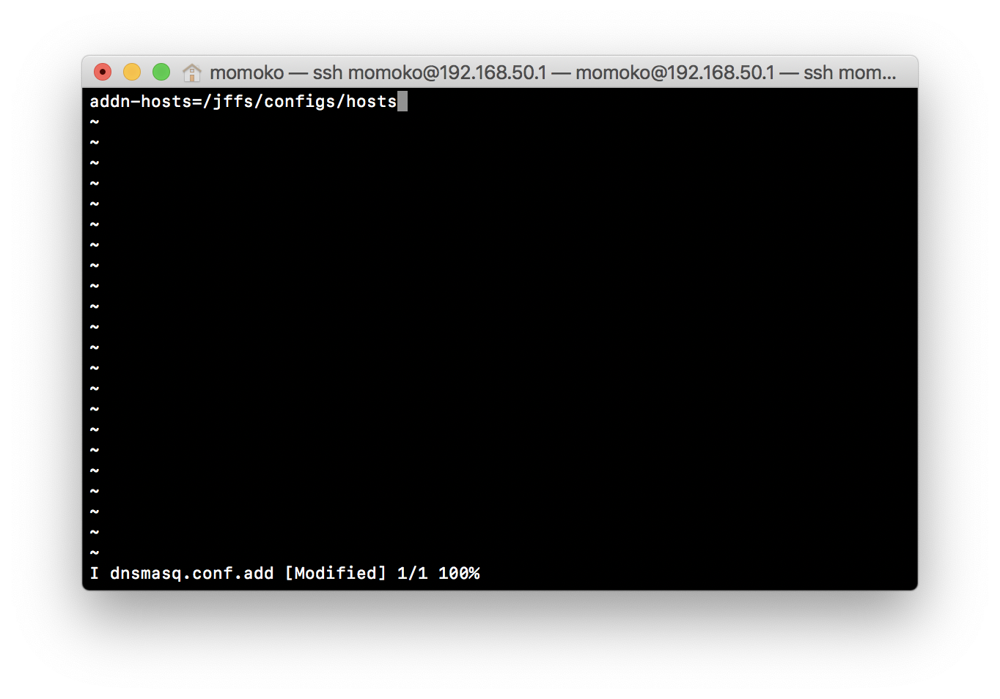
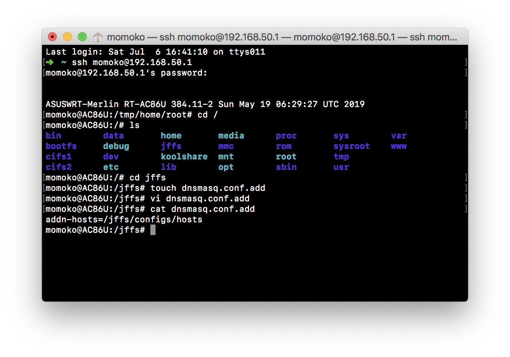
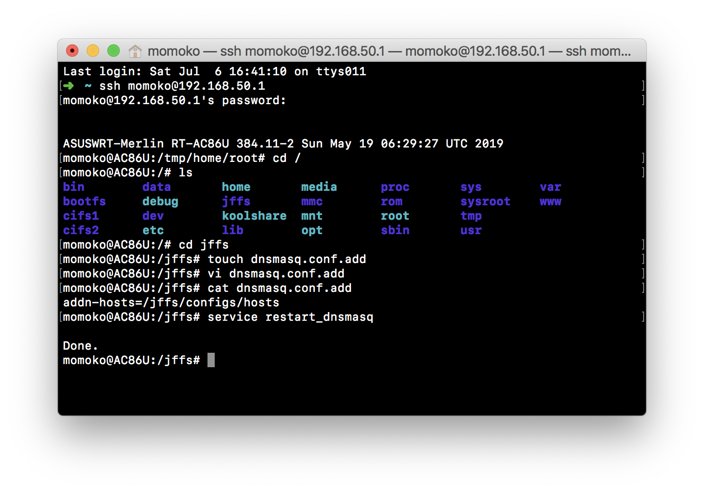

# Mac 下修改 华硕路由器 梅林固件 hosts 教程

> 前提：已刷梅林固件（[固件下载&刷机教程](https://koolshare.cn/forum.php?mod=forumdisplay&fid=96&filter=typeid&typeid=68&orderby=lastpost)）。否则无法修改 hosts。

## 路由器开启 SSH

> SSH 通道可以让我们可以远程访问路由文件。

**第一步：** 开启 SSH

打开路由管理后台（华硕默认为 192.168.50.1）。
进入系统管理 - 系统设置 - 服务。Enable SSH 选择 `LAN only`(仅内网访问)，其他按照以下截图配置即可。



**第二步：** 连接 SSH

打开 Mac 终端（如果不知道终端是啥，可以 cmd + 空格，搜索：终端.app）。

输入：

```bash
# 格式: ssh {你的路由器用户名，默认为admin}@{你的路由器ip地址}
ssh admin@192.168.50.1
```

确认后会让你输入路由器管理后台密码（不是wifi密码）。输入密码时是没有字符提示的，但是字符是输入了的（命令行的世界里，没有消息就是好消息），输完按`Enter`确认。

成功连接后，你就进入到路由的文件系统啦(｡･ω･)ﾉ


## 修改 hosts

> 这里将用到一些简单的 shell 命令。

### 方法一：使用 scp 上传文件

**第一步：** 创建文件

在 Mac 本地新建两个空白文本文件，重命名为 `dnsmasq.conf.add`，`hosts`。

使用你喜欢的文本编辑器打开并编辑 `dnsmasq.conf.add`，写入以下内容：

```txt
addn-hosts=/jffs/configs/hosts
```

`hosts` 文件中则写入你的 hosts。

**第二步：** 上传文件

> Mac 下自带 scp 命令，无需安装其他东西。

```
# 格式为：scp {文件路径} {路由器用户名}@{路由器ip}:{要上传的路径}
```

在终端中按 `cmd+n` 新建一个终端窗口。

先输入 `scp `，然后将 `dnsmasq.conf.add` 文件拖进终端（会自动生成文件路径），再输入`admin@192.168.50.1:/jffs/`，确认，输入路由器后台管理密码即可。

`hosts` 也是一样操作，但是上传路径为 `/jffs/configs/`。



**第三步：** 重启 dnsmasq 服务

> 这一步令修改的 hosts 立即生效。

在刚才的 SSH 窗口，输入：

```bash
service restart_dnsmasq
```



大功改成🎉！

### 方法二：使用 vim 编辑文件

**第一步：** 创建 dnsmasq.conf.add

依次输入：

```bash
# 回到目录顶层
cd /
# 列出文件列表
ls
# 进入 jffs 目录
cd jffs
# 创建文件 dnsmasq.conf.add
touch dnsmasq.conf.add

# 进入 vim 编辑文件
vi dnsmasq.conf.add
# 进入编辑模式（之后才能输入）
i
```


将以下内容粘贴进终端：

```txt
addn-hosts=/jffs/configs/hosts
```



编辑完成后，按键盘左上角的`esc`退出编辑模式。然后保存退出 vim：

```bash
# 保存并退出 vim（按住 shift + zz）
ZZ
# 查看文件，看下是否符合预期
cat dnsmasq.conf.add
```



**第二步：** 创建 hosts

和第一步同理，在 `/jffs/configs/` 目录下创建修改 `hosts` 文件。
不再赘述。

**第三步：** 重启 dnsmasq 服务

> 这一步令修改的 hosts 立即生效。

在刚才的 SSH 窗口，输入：

```bash
service restart_dnsmasq
```



大功改成🎉！

## 妙用 hosts

### 设置访问别名

```
192.168.50.1 momo.com
```

例如给路由器后台地址设置一个域名，这样我们在内网下，直接访问这个域名就可以进入路由器。

### 屏蔽软件更新

屏蔽锤子手机系统更新：

```
172.0.0.1 ota2.smartisan.com
172.0.0.1 ota.smartisan.com
```

屏蔽 Mac 迅雷更新：

```
127.0.0.1 liveupdate.mac.sandai.net
127.0.0.1 windows10.microdone.cn
```

### 屏蔽广告

[屏蔽小米电视/盒子开机广告 hosts](https://gist.github.com/itspig/e22bd240cff35fbb4b29fafd2539de27)

## 总结

梅林固件这么久，居然都没有直接修改 hosts 的插件(ಥ_ಥ)。

折腾路由，其乐无穷O(∩_∩)O。
